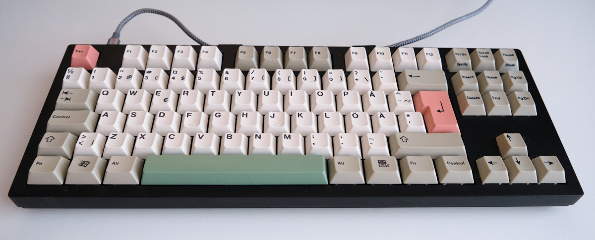

# My keyboard mods

This repository documents my custom modifications to the keyboards that I own.
Currently only the Keychron Q3.

## Keychron Q3 (ISO)

[Keychron Q3](https://www.keychron.com/products/keychron-q3-qmk-custom-mechanical-keyboard)
is a
[mechanical keyboard](https://en.wikipedia.org/wiki/Keyboard_technology#Mechanical-switch_keyboard)
running the open source [QMK firmware](https://docs.qmk.fm/#/).



On my keyboard, I'm running the [Vial fork](https://get.vial.today/) of the QMK firmware, and my
modifications are based on that.

This repository contains a custom keymap called "desaster", and an user
directory called "desaster". Described below are some of the more elaborate
changes in the source code, but some more basic configuration or layout
changes are not documented.

I would not advise to use my customizations as-is without carefully examining
the changes first.

### Building

This repository utilizes the QMK
[userspace](https://github.com/qmk/qmk_userspace) functionality,
which allows keeping custom keymaps outside the main qmk repository.

To make installing really simple, the included Dockerfile will create a build
environment containing the [qmk](https://github.com/qmk/qmk_cli) cli and [vial-qmk](https://github.com/vial-kb/vial-qmk).

To build the custom docker image, run:

```
docker build -t qmk-vial-userspace-builder:latest .
```

To build the customized firmware, simply run:

```sh
docker run -it --rm -v $(pwd):/qmk-userspace qmk-vial-userspace-builder
```

Or alternatively specify the keyboard and keymap, also letting you see error messages:

```sh
docker run -it --rm -v $(pwd):/qmk-userspace qmk-vial-userspace-builder qmk compile -kb keychron/q3/iso -km desaster
```

### Layers

*For more information about layers in QMK, see the [documentation on Layers](https://docs.qmk.fm/#/feature_layers?id=working-with-layers)*

Out of the box, the firmware on the Q3 is configured so that there are two
"default" layers, WIN and MAC. These layers can be switched using the built-in
toggle switch. Additionally there is one momentary layer for each, which can
be momentarily toggled with the Fn key. The Fn layer can be used for things
like RGB controls, or any user defined extra keys.

| Layer | Type              |
| ----- | ----------------- |
| 0     | **MAC (Default)** |
| 1     | Fn (Momentary)    |
| 2     | **WIN (Default)** |
| 3     | Fn (Momentary)    |

Since I don't need separate MAC/WIN layers, I opted to create a different
layer layout. In my setup I only have one base layer (WIN), four additional
toggleable layers, and a single momentary Fn layer.

The extra layers can be toggled on and off as needed, and they typically
override only a few keys. Since there are several layers available for toggling,
the DIP switch isn't very useful anymore, so it's been disabled by setting
`DIP_SWITCH_ENABLE = no` in `keyboards/keychron/q3/iso/keymaps/desaster/rules.mk`

The Fn layer is activated the same way as before by momentarily holding the
Fn key, and typically contains actions such as RGB controls and toggling other
layers.

| Layer | Type              | Description        |
| ----- | ----------------- | ------------------ |
| 0     | **WIN (Default)** | Always active, other layers override individual keys |
| 1     | AUX1              | Toggled with Fn-1  |
| 2     | AUX2              | Toggled with Fn-2  |
| 3     | AUX3              | Toggled with Fn-3  |
| 4     | AUX4              | Toggled with Fn-4  |
| 5     | Fn                | Momentarily toggled with Fn |

The changes to the layer setup are located in my custom keymap `keyboards/keychron/q3/iso/keymaps/desaster/keymap.c`.

### Brightness cycle

This feature adds a new custom mappable action called "Brightness Cycle".

This is useful when using the "Solid Color" RGB effect just to subtly light up the
keyboard. The brightness cycle will adjust the brightness in three steps (Off,
Dim, Bright). When mapped to `Fn-SPACE`, it functions much like the brightness
control on some Lenovo laptops.

[q3_br_cycle.webm](https://github.com/desaster/keyboard-hacks/assets/631441/1b234d95-7dbd-4559-a4f1-506e2b08e9e8)

### Countdown timer

The RGB functionality on the keyboard is pretty, but quite useless by default.
As my first attempt at turning it into something more useful, I created a
simple countdown timer.

This could be used as a tea timer, for example.

This feature adds two new actions, "**Timer Add**" and "**Timer Reset**",
which can be mapped to any key through Vial.

For example, on my keyboard `Fn-INS` starts the countdown and `Fn-Del`
resets it.

When the countdown is active, a number key corresponding to the minutes left
in the timer will blink. When the timer reaches zero, a flashy RGB effect is
activated for a short time.

[q3_countdown_timer.webm](https://github.com/desaster/keyboard-hacks/assets/631441/04391aad-9f8f-408c-9988-60910197b702)

### Layer spell out

With the extra layers being just layers from 1 through 4, it can be hard to
remember what you have them mapped for.

The layer spell out feature allows giving those layers short names, which will
then be lit on the keyboard when the layer is toggled.

For example, if the auxiliary layer 1 is for enabling some extra media keys,
the layer could be called "**media**". When the layer is toggled on, the keys
`M`, `E`, `D`, `I` and `A` will be shortly lit in sequence.

[q3_layer_spellout.webm](https://github.com/desaster/keyboard-hacks/assets/631441/d961ddd0-3723-4429-90c9-e8e89675b8eb)

Unfortunately the layer names have to be hard-coded in the keymap source code.

```c
const char *layer_indicators[] = {
    "def",      // won't be used
    "alpha",
    "bravo",
    "charlie",
    "delta",
    "fn",       // won't be used
};
```

A future improvement might be to allow entering layer names using the keyboard
itself, and
[storing them in eeprom](https://github.com/qmk/qmk_firmware/blob/master/docs/feature_eeprom.md#persistent-configuration-eeprom).

### Anti idle

A simple toggleable anti-idle feature that sends a shift keypress every 2-4
minutes. Additionally blinks a key to indicate that the anti-idle is enabled.

This feature adds a new action, "**Anti Idle**", which can be mapped to any
key through Vial. The blinking key is still harcoded to `PgUp`, though.
